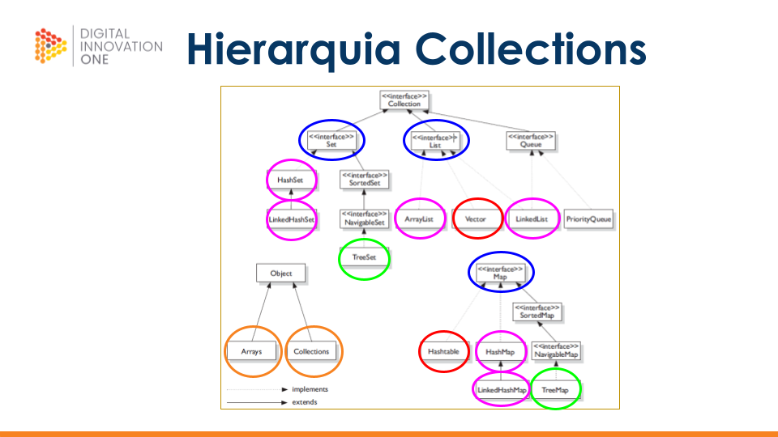

# java-poo

- Programação Orientada a Objetos com Java
	- Objeto
	- Herança
	- Interfaces

- Uso do Framework da interface Collection
	- [List](./assets/2-list.png) (ArrayList, LinkedList)
	- [Set](./assets/3-set.png) (HashSet, LinkedHashSet, TreeSet)
	- [Map](./assets/4-map.png) (HashMap, LinedHashMap, TreeMap)
	- Stream

